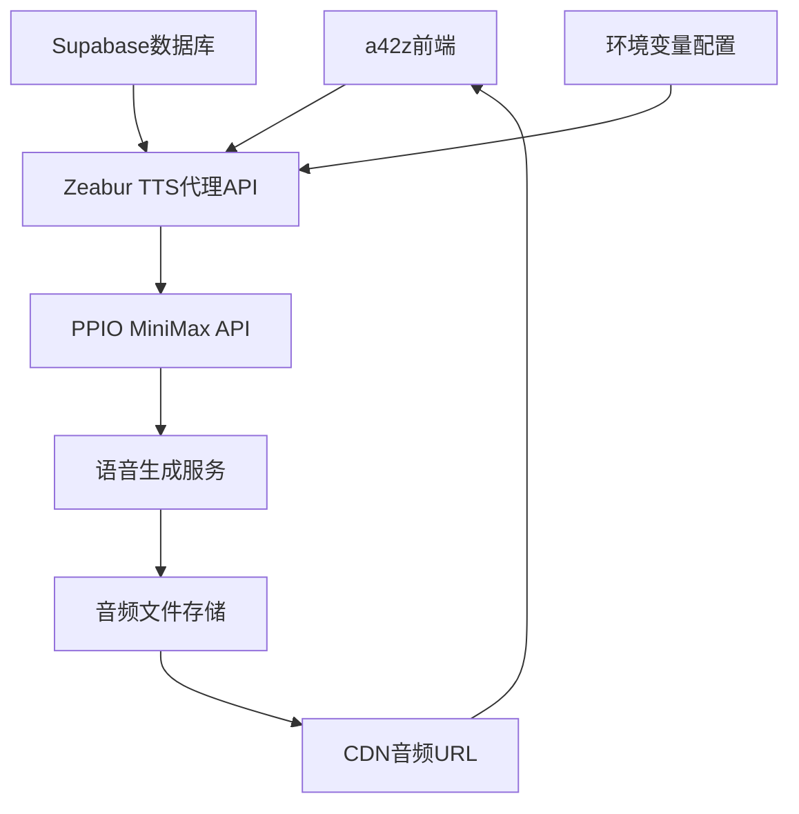

# 🔧 TTS API技术架构与工作原理

## 📋 系统架构概览



### 🎯 核心组件

1. **前端应用** (a42z.ai)
2. **TTS代理API** (Zeabur部署)
3. **PPIO MiniMax服务** (第三方TTS提供商)
4. **Supabase数据库** (可选，用于数据存储)

---

## 🔄 完整工作流程

### 1. 前端发起请求

**HTTP请求格式**:
```http
POST https://your-domain.zeabur.app/api/tts
Content-Type: application/json

{
  "text": "Hello, this is a test message.",
  "speaker": "sam_altman"
}
```

**JavaScript发送代码**:
```javascript
const response = await fetch('https://your-domain.zeabur.app/api/tts', {
  method: 'POST',
  headers: {
    'Content-Type': 'application/json'
  },
  body: JSON.stringify({
    text: 'Hello, this is a test message.',
    speaker: 'sam_altman'
  })
})

const result = await response.json()
```

### 2. TTS代理API处理

**请求接收** (`src/routes/tts.js`):
```javascript
router.post('/', async (req, res) => {
  try {
    const { text, speaker } = req.body
    
    // 1. 参数验证
    if (!text || !speaker) {
      return res.status(400).json({
        success: false,
        error: '缺少必需参数'
      })
    }
    
    // 2. 调用PPIO服务
    const result = await ppioClient.generateSpeech(text, speaker)
    
    // 3. 返回结果
    res.json(result)
  } catch (error) {
    res.status(500).json({
      success: false,
      error: error.message
    })
  }
})
```

### 3. PPIO API调用

**Voice ID映射** (`src/lib/ppio.js`):
```javascript
class PPIOClient {
  constructor() {
    this.voiceMap = {
      'sam_altman': process.env.VOICE_SAM_ALTMAN,
      'feifeili': process.env.VOICE_FEIFEILI,
      'wuenda': process.env.VOICE_WUENDA,
      'paul_graham': process.env.VOICE_PAUL_GRAHAM
    }
  }

  async generateSpeech(text, speaker) {
    const voiceId = this.getVoiceId(speaker)
    
    // 构建PPIO API请求
    const payload = {
      audio_url: voiceId,  // 使用Voice ID
      text: text,
      model: "speech-02-hd",
      need_noise_reduction: true,
      need_volume_normalization: true
    }
    
    // 发送到PPIO
    const response = await fetch(this.apiUrl, {
      method: 'POST',
      headers: {
        'Authorization': `Bearer ${this.apiToken}`,
        'Content-Type': 'application/json'
      },
      body: JSON.stringify(payload)
    })
    
    return await response.json()
  }
}
```

### 4. PPIO服务处理

**PPIO内部流程**:
1. 接收文本和Voice ID
2. 使用预训练的语音模型
3. 应用Voice ID对应的声音特征
4. 生成音频文件
5. 上传到CDN存储
6. 返回音频URL

**PPIO响应格式**:
```json
{
  "demo_audio_url": "https://faas-minimax-audio-xxx.cos.ap-shanghai.myqcloud.com/xxx.mp3",
  "voice_id": "voice_4bc8f72b-71ed-4089-a93e-ad3381fde6e5"
}
```

### 5. 代理API响应处理

**响应格式化** (`src/lib/ppio.js`):
```javascript
// 处理PPIO响应
if (apiResponse.demo_audio_url) {
  return {
    success: true,
    audioUrl: apiResponse.demo_audio_url,
    voiceId: voiceId,
    textPreview: text.substring(0, 50) + (text.length > 50 ? '...' : ''),
    speaker: speaker,
    timestamp: new Date().toISOString()
  }
} else {
  throw new Error('语音生成失败')
}
```

### 6. 前端接收和播放

**音频播放处理**:
```javascript
const result = await response.json()

if (result.success && result.audioUrl) {
  // 创建音频对象
  const audio = new Audio(result.audioUrl)
  
  // 添加事件监听
  audio.addEventListener('canplay', () => {
    console.log('音频加载完成')
  })
  
  audio.addEventListener('ended', () => {
    console.log('播放完成')
  })
  
  // 开始播放
  await audio.play()
}
```

---

## 🔍 数据流详解

### 文本处理流程

```
用户输入文本
    ↓
前端JavaScript封装
    ↓
HTTP POST请求
    ↓
Express路由接收
    ↓
参数验证和清理
    ↓
Voice ID映射
    ↓
PPIO API调用
    ↓
语音合成处理
    ↓
音频文件生成
    ↓
CDN URL返回
    ↓
前端音频播放
```

### 关键数据转换

1. **文本 → JSON**:
   ```javascript
   "Hello World" → {"text": "Hello World", "speaker": "sam_altman"}
   ```

2. **Speaker → Voice ID**:
   ```javascript
   "sam_altman" → "voice_4bc8f72b-71ed-4089-a93e-ad3381fde6e5"
   ```

3. **PPIO请求格式**:
   ```json
   {
     "audio_url": "voice_4bc8f72b-71ed-4089-a93e-ad3381fde6e5",
     "text": "Hello World",
     "model": "speech-02-hd",
     "need_noise_reduction": true,
     "need_volume_normalization": true
   }
   ```

4. **最终响应**:
   ```json
   {
     "success": true,
     "audioUrl": "https://cdn.example.com/audio.mp3",
     "textPreview": "Hello World",
     "speaker": "sam_altman",
     "voiceId": "voice_xxx",
     "timestamp": "2025-07-26T16:20:00.673Z"
   }
   ```

---

## ⚙️ 环境变量配置

### 必需的环境变量

```env
# PPIO API配置
PPIO_API_TOKEN=sk_P7dvruEBeOoxYXN4lILmfwmB4DvpmSxSvzrPVGwU01c
PPIO_API_URL=https://api.ppinfra.com/v3/minimax-voice-cloning

# Voice ID映射
VOICE_SAM_ALTMAN=voice_4bc8f72b-71ed-4089-a93e-ad3381fde6e5
VOICE_FEIFEILI=voice_c514c3d8-1d62-4e49-8526-d82fd857548b
VOICE_WUENDA=voice_7fcc1d94-d0ec-4a39-91fe-508b0fb43af6
VOICE_PAUL_GRAHAM=voice_bb4693a9-4ece-4c68-961d-30016cfd10f9

# 服务配置
NODE_ENV=production
PORT=3000
ALLOWED_ORIGIN=https://a42z.ai
```

### 配置加载流程

```javascript
// 应用启动时加载
require('dotenv').config()

// PPIOClient初始化时读取
constructor() {
  this.apiToken = process.env.PPIO_API_TOKEN
  this.voiceMap = {
    'sam_altman': process.env.VOICE_SAM_ALTMAN,
    // ...其他映射
  }
}
```

---

## 🛡️ 安全机制

### 1. API密钥保护

```javascript
// 前端永远不会看到真实的API Token
// 所有敏感信息都在服务端处理

// ❌ 错误做法 - 前端直接调用
fetch('https://api.ppinfra.com/v3/minimax-voice-cloning', {
  headers: {
    'Authorization': 'Bearer sk_xxx' // 暴露API密钥
  }
})

// ✅ 正确做法 - 通过代理
fetch('https://your-domain.zeabur.app/api/tts', {
  headers: {
    'Content-Type': 'application/json' // 无敏感信息
  }
})
```

### 2. CORS保护

```javascript
// 只允许特定域名访问
app.use(cors({
  origin: process.env.ALLOWED_ORIGIN || 'https://a42z.ai',
  credentials: true
}))
```

### 3. 请求频率限制

```javascript
const limiter = rateLimit({
  windowMs: 15 * 60 * 1000, // 15分钟
  max: 100, // 最多100次请求
  message: '请求过于频繁，请稍后再试'
})
```

---

## 🔄 错误处理机制

### 1. 分层错误处理

```javascript
// 前端层
try {
  const result = await tts.playText(text, speaker)
} catch (error) {
  console.error('前端错误:', error.message)
  showUserError('语音播放失败，请重试')
}

// 代理API层
try {
  const result = await ppioClient.generateSpeech(text, speaker)
  res.json(result)
} catch (error) {
  console.error('API错误:', error)
  res.status(500).json({
    success: false,
    error: '服务暂时不可用'
  })
}

// PPIO客户端层
async generateSpeech(text, speaker, retryCount = 0) {
  try {
    return await this.callPPIOAPI(text, speaker)
  } catch (error) {
    if (retryCount < 3) {
      await this.delay(1000 * (retryCount + 1))
      return this.generateSpeech(text, speaker, retryCount + 1)
    }
    throw error
  }
}
```

### 2. 容错机制

```javascript
// 模拟模式回退
if (!this.apiToken || process.env.ENABLE_MOCK_MODE === 'true') {
  console.log('🎭 启用模拟模式')
  return this.generateMockResponse(text, speaker)
}

// 网络超时处理
const controller = new AbortController()
const timeoutId = setTimeout(() => controller.abort(), 30000)

const response = await fetch(this.apiUrl, {
  signal: controller.signal,
  // ...其他配置
})
```

---

## 📊 性能优化

### 1. 请求优化

- **文本长度限制**: 单次请求≤2000字符
- **并发控制**: 避免同时多个请求
- **超时设置**: 30秒请求超时

### 2. 音频处理

- **预加载**: 提前加载音频文件
- **缓存策略**: 缓存常用音频URL
- **压缩优化**: 使用适当的音频格式

### 3. 用户体验

- **加载状态**: 实时显示生成进度
- **错误重试**: 自动重试失败的请求
- **离线处理**: 网络异常时的优雅降级

---

## 🔧 调试和监控

### 1. 日志记录

```javascript
console.log(`🎯 开始生成语音: ${speaker} - 文本长度: ${text.length}`)
console.log(`📝 API响应时间: ${Date.now() - startTime}ms`)
console.log(`✅ 语音生成成功: ${result.audioUrl}`)
```

### 2. 健康检查

```javascript
// GET /health
{
  "status": "ok",
  "timestamp": "2025-07-26T16:20:00.673Z",
  "uptime": 26.328636333,
  "environment": "production",
  "version": "1.0.0"
}
```

这就是完整的TTS API工作原理！从前端发送文本到最终播放音频的整个数据流和处理机制。🚀
